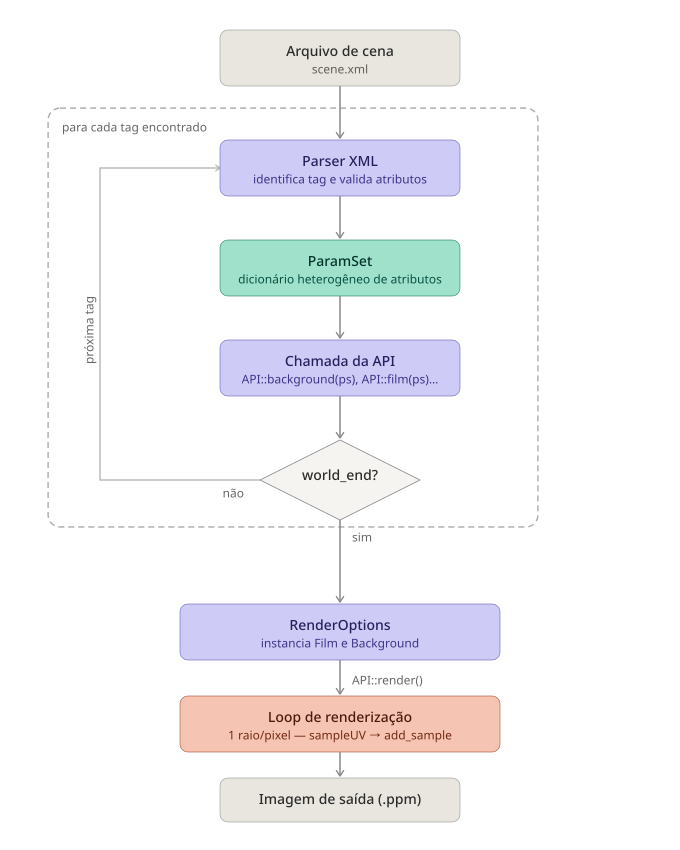

# Project 1 - Basic Infrastructure

This is the basic architecture for the Ray Tracing Teaching Tool (RT3) Project.

Most of the class are incomplete. For instance, there is no `Vector3f` class.
Replace that with your own math library or expand the class already there.

# Processing flow

The `main.cpp` calls the `api.cpp`, which, in turn, calls various API functions that create the objects, such as camera, integrator, scene, film.
The information to create these classes are stored in the `RenderOptions` struct, while the scene is being parsed.

When the parser finds the tag `world_end` it creates all the objects (film, camera, scene, integrator) and calls the `render()` method.
This method corresponds to the "main loop" of the rendering process.

<!--  -->


# To compile

```
cmake -S . -B build
cmake --build build
./build/rt3 scenes/scene01.xml
```

# TODO

- [ ] Cameras
- [ ] Integrators
- [ ] Math class (vector and Ray)

---

&copy; DIMAp/UFRN 2024-2026.
